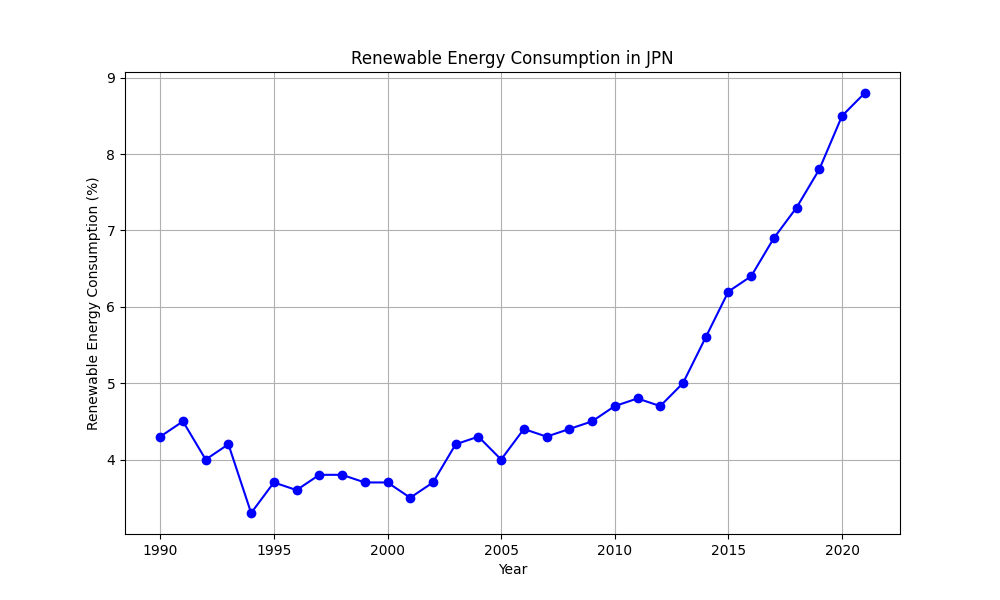

# Global Environment API

This project provides a RESTful API to fetch and analyze climate data and renewable energy consumption data. It is designed for environmental research and decision-making support.

## Features

1. **Climate Data**:
   - Retrieve average global temperatures by year and country.

2. **Renewable Energy Data**:
   - Fetch renewable energy consumption by country.
   - Query energy consumption for a specific year.
   - Combine queries for country and year.

3. **Efficient Data Handling**:
   - Powered by Google BigQuery for large-scale data storage and fast queries.

## API Endpoints

| Method | Endpoint                                | Description                                              |
|--------|-----------------------------------------|----------------------------------------------------------|
| GET    | `/`                                     | Health check for the API.                                |
| GET    | `/energy/climate-data`                  | Fetch climate data (average temperatures).               |
| GET    | `/energy/renewable-energy/{country_code}` | Fetch renewable energy consumption for a country.       |
| GET    | `/energy/renewable-energy/year/{year}`  | Fetch energy data for a specific year.                   |
| GET    | `/energy/renewable-energy/{country_code}/{year}` | Fetch energy data for a country and year.          |
| GET    | `/energy/graph/renewable-energy/{country_code}` | Generate and display a graph for renewable energy trends.    |
| GET    | `/energy/graph/save/renewable-energy/{country_code}` | Save the graph to `static/graphs` and download it.          |

### Graph Generation

1. **Display Graphs:**
   - Access the endpoint to generate and display a graph directly in the browser:
     - Example: `http://127.0.0.1:8000/energy/graph/renewable-energy/JPN`

2. **Save Graphs:**
   - To save a graph locally, access the following endpoint:
     - Example: `http://127.0.0.1:8000/energy/graph/save/renewable-energy/JPN`
   - The graph will be saved in the `static/graphs/` directory. For example:
     - `static/graphs/JPN_renewable_energy.png`

3. **Folder Structure:**
   - Ensure that the `static/graphs/` directory exists and has the necessary permissions.

### Example Graphs

#### Renewable Energy Consumption in Japan


#### Renewable Energy Consumption in USA


## Getting Started

### Prerequisites

- Python 3.10 or later
- Google Cloud SDK installed
- Access to a Google Cloud Project with BigQuery enabled
- Environment variables:
  - `GOOGLE_APPLICATION_CREDENTIALS`: Path to the service account key JSON file.

### Installation

1. Clone the repository:
```bash
git clone https://github.com/JourneySculptor/global_environment_api.git
cd global_environment_api
```
2. Install dependencies:
```bash
   pip install -r requirements.txt
```
3. Set up environment variables:
```bash
   export GOOGLE_APPLICATION_CREDENTIALS="path/to/your/keyfile.json"
```
4. Run the server:
```bash
   uvicorn app.api_server:app --reload
```
5. Test the endpoints:
- Example: Fetch climate data:
```bash
   curl -X GET "http://127.0.0.1:8000/energy/climate-data"
```
- Example: Fetch renewable energy data for Japan:
```bash
   curl -X GET "http://127.0.0.1:8000/energy/renewable-energy/JPN"
```

## Project Structure
```plaintext
global_environment_api/
├── app/
│   ├── api_server.py         # FastAPI application
│   ├── routers/
│   │   └── energy.py         # API endpoints for energy data
│   ├── utils/
│       └── data_client.py    # Helper functions for BigQuery
├── static/                   
│   └── graphs/ 
├── tests/
│   └── test_energy.py        # Pytest test cases
├── data/                     # Placeholder for any sample data
├── Dockerfile                # Configuration for Docker containerization
├── requirements.txt          # Python dependencies
├── .env                      # Environment variables (not committed)
└── README.md                 # Project documentation
```

## Future Enhancements
1. **Data Visualization:**
- Add endpoints to serve graphs for energy consumption trends.
2. **Deployment:**
- Deploy the API to Google Cloud for public access.
3. **Authentication:**
- Add API key-based authentication for enhanced security.

## License
This project is licensed under the MIT License.