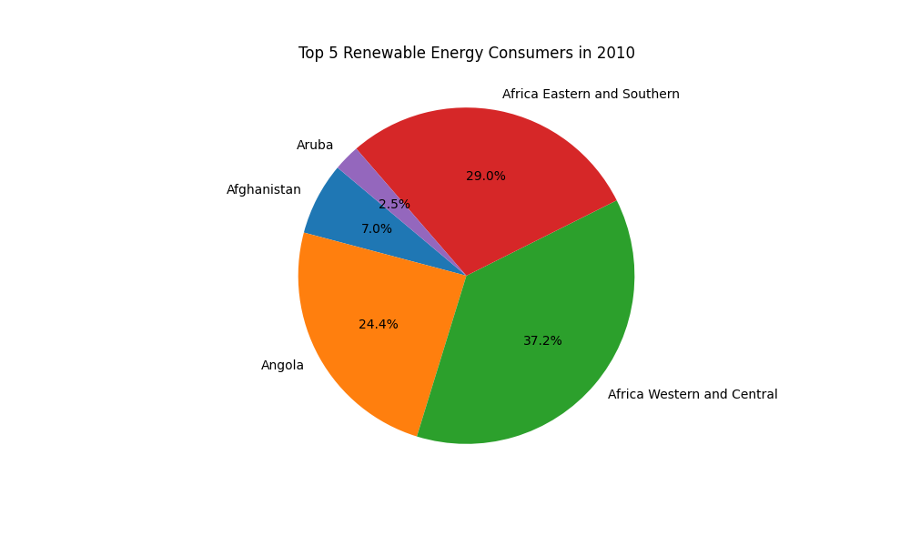

# Global Environment API

This project provides a robust and scalable RESTful API for analyzing **climate data** and **renewable energy consumption trends**. Designed for environmental researchers, data analysts, and decision-makers, it enables querying, filtering, and visualization of global data with ease.

---

## **Features**

1. **Climate Data Filtering**:
   - Retrieve global temperature data by **year** and **country**.
   - Example: `/energy/climate-data?year=2020&country=USA`

2. **Renewable Energy Trends**:
   - Fetch renewable energy consumption data for any country and year.
   - Visualize energy trends with **bar charts, line graphs, and pie charts**.

3. **Graph Generation & Saving**:
   - Generate interactive graphs for energy data.
   - Save graphs locally for reports or presentations.

4. **High Performance**:
   - Built on **FastAPI** and powered by **Google BigQuery** for fast data querying.

---

## **API Endpoints**

### **Climate Data**
| Method | Endpoint                   | Description                                      |
|--------|----------------------------|--------------------------------------------------|
| GET    | `/energy/climate-data`     | Fetch climate data (average temperature).        |
| GET    | `/energy/climate-data?year=2020` | Filter data by year.                          |
| GET    | `/energy/climate-data?country=USA` | Filter data by country.                     |
| GET    | `/energy/climate-data?year=2020&country=USA` | Combine filters for year and country. |

#### Example Response:
```json
{
  "status": "success",
  "data": [
    {"year": 2020, "temp": 14.8, "country": "Global"},
    {"year": 2020, "temp": 15.2, "country": "Sweden"}
  ]
}
```

---

### **Renewable Energy Data**
| Method | Endpoint                                      | Description                                     |
|--------|----------------------------------------------|-------------------------------------------------|
| GET    | `/energy/renewable-energy/{country_code}`    | Fetch renewable energy consumption by country.  |
| GET    | `/energy/graph/pie/renewable-energy/{year}`  | Generate a pie chart for top energy consumers. |
| GET    | `/energy/graph/bar/renewable-energy/{country_code}` | Generate a bar chart for energy trends. |
| GET    | `/energy/graph/line/renewable-energy/{country_code}` | Generate a line chart for energy trends. |

---

## **Graph Generation**

### **1. Display Graphs**
Generate graphs directly in the browser.

- **Example**:  
  - Bar Chart: `http://127.0.0.1:8000/energy/graph/bar/renewable-energy/JPN`  
  - Line Chart: `http://127.0.0.1:8000/energy/graph/line/renewable-energy/JPN`  
  - Pie Chart: `http://127.0.0.1:8000/energy/graph/pie/renewable-energy/2010`

### **2. Save Graphs Locally**
Save generated graphs as PNG files to the `static/graphs/` folder.

- **Example**:  
  - `static/graphs/JPN_bar_chart.png`  
  - `static/graphs/top_10_renewable_2010.png`

---

## **Example Graphs**

### **Bar Chart: Renewable Energy in Japan**


### **Line Chart: Renewable Energy in Japan**


### **Pie Chart: Top 10 Renewable Energy Consumers (2010)**


---

## **Getting Started**

### **Prerequisites**
- Python 3.10+
- Google Cloud SDK with BigQuery enabled.
- Set the `GOOGLE_APPLICATION_CREDENTIALS` environment variable.

### **Installation Steps**

1. Clone the repository:
   ```bash
   git clone https://github.com/JourneySculptor/global_environment_api.git
   cd global_environment_api
   ```

2. Install dependencies:
   ```bash
   pip install -r requirements.txt
   ```

3. Set your Google service account key:
   ```bash
   export GOOGLE_APPLICATION_CREDENTIALS="path/to/keyfile.json"
   ```

4. Run the server locally:
   ```bash
   uvicorn app.api_server:app --reload
   ```

5. Test the API:
   ```bash
   curl -X GET "http://127.0.0.1:8000/energy/climate-data"
   ```

---

## **Folder Structure**

```plaintext
global_environment_api/
├── app/
│   ├── api_server.py         # FastAPI application
│   ├── routers/
│   │   └── energy.py         # API endpoints
│   ├── utils/
│       └── data_client.py    # BigQuery client helper
├── static/                   
│   └── graphs/               # Saved graph images
├── tests/                    
│   └── test_energy.py        # Unit tests
├── requirements.txt          # Dependencies
├── Dockerfile                # Docker setup
└── README.md                 # Project documentation
```

---

## **Future Enhancements**
- **Authentication**: API key-based authentication for security.
- **Data Analysis**: Advanced energy trend predictions using machine learning.
- **Deployment**: Deploy to Google Cloud Run or AWS Lambda for scalability.

---

## **License**
This project is licensed under the MIT License.
