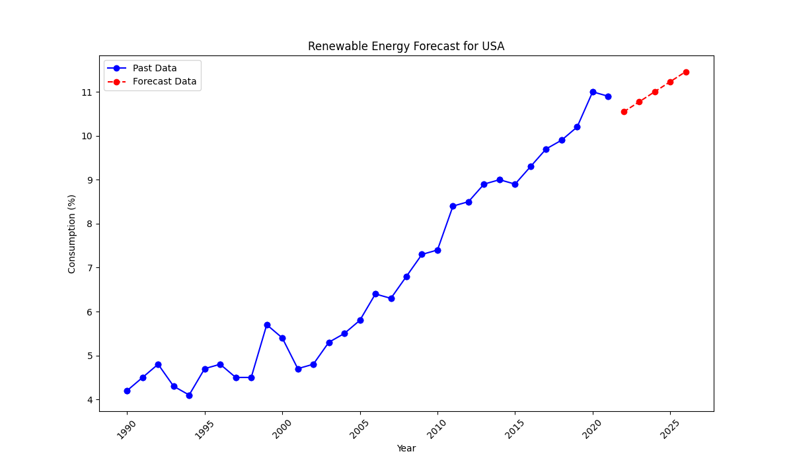

# Global Environment API

This project provides a robust and scalable RESTful API for analyzing **climate data** and **renewable energy consumption trends**. Designed for environmental researchers, data analysts, and decision-makers, it enables querying, filtering, and visualization of global data with ease.

> **Key Highlights**  
> - **Export** renewable energy forecast data in CSV, Excel, or PDF for direct use in reports.  
> - **Mermaid Diagram** (below) to illustrate the flow of API endpoints.  
> - **High Performance**: Powered by BigQuery (for large datasets) and FastAPI (for fast concurrency).

---

## Table of Contents
- [Features](#features)
- [Why BigQuery & FastAPI?](#why-bigquery--fastapi)
- [API Flow Diagram](#api-flow-diagram)
- [Key Endpoints](#key-endpoints)
  - [Export Forecast](#export-forecast)
  - [Climate Data](#climate-data)
  - [Renewable Energy Forecast](#renewable-energy-forecast)
  - [Energy Graphs](#energy-graphs)
- [Example Responses](#example-responses)
- [Graph Generation](#graph-generation)
- [Test Coverage](#test-coverage)
- [Getting Started](#getting-started)
- [Folder Structure](#folder-structure)
- [Future Enhancements](#future-enhancements)
- [License](#license)

---

## Features

1. **Climate Data Filtering**  
   - Retrieve global temperature data by **year** and **country**.  
   - Example: `/energy/climate-data?year=2020&country=USA`

2. **Renewable Energy Trends**  
   - Fetch renewable energy consumption data for any country and year.  
   - Visualize energy trends with **bar charts, line graphs**.

3. **Graph Generation & Saving**  
   - Generate interactive graphs for energy data, including **forecast trends**.  
   - Save graphs locally for reports or presentations.

4. **Detailed Report Generation**  
   - Export renewable energy forecast data as **CSV**, **Excel**, or **PDF**.  
   - **Dynamic Report Formats**: Tailored exports based on user-specified formats.  
   - Example: `/energy/export/forecast?country=USA&years=5&format=csv`

5. **Renewable Energy Forecasting**  
   - Predict future renewable energy consumption trends based on historical data.  
   - Generate forecast charts with confidence intervals.  
   - Example: `/energy/forecast/renewable-energy?country=USA&years=5`

6. **Debugging Support**  
   - A dedicated tool, `search_keywords.py`, helps developers quickly locate specific terms in the codebase.

---

## Why BigQuery & FastAPI?

- **BigQuery**:  
  - Handles large datasets efficiently with minimal management overhead.  
  - Ideal for climate data and renewable energy datasets, which can grow significantly over time.  

- **FastAPI**:  
  - Offers high concurrency and speed, which is crucial for on-demand data queries and real-time data filtering.  
  - Automatic API documentation (OpenAPI/Swagger UI) for rapid development and easy endpoint testing.

---

## API Flow Diagram

Below is a mermaid diagram illustrating how the main API endpoints interact with BigQuery and various utility modules:


    
---

## **Key Endpoints**

### **Export Forecast**
**Endpoint**: `/energy/export/forecast`
Export forecasted renewable energy data.
| Method | Endpoint                   | Description                                      |
|--------|----------------------------|--------------------------------------------------|
| GET    | `/energy/export/forecast`  | Export forecast in **CSV**, **Excel**, or **PDF**. |
**Example Queries**:
```bash
# Export as CSV
curl -X GET "http://127.0.0.1:8000/energy/export/forecast?country=USA&years=5&format=csv"
```
```bash
# Export as Excel
curl -X GET "http://127.0.0.1:8000/energy/export/forecast?country=USA&years=5&format=excel"
```
```bash
# Export as PDF
curl -X GET "http://127.0.0.1:8000/energy/export/forecast?country=USA&years=5&format=pdf"
```
Supported format values:
  - csv
  - excel
  - pdf

### **Climate Data**
| Method | Endpoint                   | Description                                      |
|--------|----------------------------|--------------------------------------------------|
| GET    | `/energy/climate-data`     | Fetch climate data (average temperature).        |
| GET    | `/energy/climate-data?year=2020` | Filter data by year.                          |
| GET    | `/energy/climate-data?country=USA` | Filter data by country.                     |
| GET    | `/energy/climate-data?year=2020&country=USA` | Combine filters for year and country. |

### **Renewable Energy Forecast**
| Method | Endpoint                   | Description                                      |
|--------|----------------------------|--------------------------------------------------|
| GET    | `/energy/forecast/renewable-energy` | Predict future renewable energy consumption. |

### **Energy Graphs**
| Method | Endpoint                   | Description                                      |
|--------|----------------------------|--------------------------------------------------|
| GET    | `/energy/graph/bar/renewable-energy/{country_code}` | Generate a bar chart for energy trends. |
| GET    | `/energy/graph/line/renewable-energy/{country_code}` | Generate a line chart for energy trends. |


### **Example Responses**

#### **Forecast(JSON)**
```bash
curl -X GET "http://127.0.0.1:8000/energy/forecast/renewable-energy?country=USA&years=5"
```
```json
{
  "status": "success",
  "data": [
    {"year": 2022, "predicted_consumption": 10.54},
    {"year": 2023, "predicted_consumption": 10.77},
    {"year": 2024, "predicted_consumption": 11.0},
    {"year": 2025, "predicted_consumption": 11.23},
    {"year": 2026, "predicted_consumption": 11.46}
  ],
  "graph_url": "/static/graphs/USA_forecast_chart.png"
}
```

#### **Export (CSV)**
```bash
curl -X GET "http://127.0.0.1:8000/energy/export/forecast?country=USA&years=5&format=csv"
```
```json
{
  "status": "success",
  "file_url": "/static/exports/USA_forecast.csv"
}
```

---
## **Graph Generation**

### **1. Display Graphs**
  - Bar Chart Example:
   `http://127.0.0.1:8000/energy/graph/bar/renewable-energy/JPN`
  - Line Chart Example:
   `http://127.0.0.1:8000/energy/graph/line/renewable-energy/JPN`

### **2. Save Graphs Locally**
  - Saved as PNG files in `static/graphs/` folder.
      - `static/graphs/JPN_bar_chart.png`
      - `static/graphs/JPN_line_chart.png`

---


## **Example Graphs**

### **Bar Chart: Renewable Energy in Japan**


### **Line Chart: Renewable Energy in Japan**


### **Forecast Chart: Renewable Energy in USA**


### **Forecast Report: Renewable Energy in USA (CSV)**


### **Forecast Report: Renewable Energy in USA (Excel)**


### **Forecast Report: Renewable Energy in USA (PDF)**


---

## **Test Coverage**

This project has comprehensive unit tests to ensure reliability and accuracy. Current test coverage:

**Newly added tests**:
- Export functionality for CSV, Excel, and PDF.
- Validations for renewable energy forecast parameters.

```plaintext
---------- coverage: platform win32, python 3.12.4-final-0 -----------
Name                            Stmts   Miss  Cover
---------------------------------------------------
app\routers\energy.py             130      5    96%
app\routers\predictions.py         55      2    96%
app\utils\chart_utils.py           60     15    75%
app\utils\data_client.py           25      0   100%
app\utils\export_utils.py          50      5    90%
app\utils\report_utils.py          35      0   100%
---------------------------------------------------
TOTAL                             355     27    92%
```
**Note**: Ongoing efforts aim to improve coverage, especially for `export_utils.py` and `chart_utils.py`.

---
## **Getting Started**

### **Prerequisites**
- Python 3.10+
- Google Cloud SDK with BigQuery enabled.
- Set the `GOOGLE_APPLICATION_CREDENTIALS` environment variable.

### **Installation Steps**
1. Clone the repository:
   ```bash
   git clone https://github.com/JourneySculptor/global_environment_api.git
   cd global_environment_api
   ```

2. Install dependencies:
   ```bash
   pip install -r requirements.txt
   ```

3. Set your Google service account key:
   ```bash
   export GOOGLE_APPLICATION_CREDENTIALS="path/to/keyfile.json"
   ```
   On Windows (CMD):
   ```bash
   set GOOGLE_APPLICATION_CREDENTIALS="path\to\keyfile.json"
   ``` 
   Or PowerShell:
   ```bash
   $env:GOOGLE_APPLICATION_CREDENTIALS="path\to\keyfile.json"
   ``` 

4. Run the server locally:
   ```bash
   uvicorn app.api_server:app --reload
   ```

5. Test the API:
   ```bash
   curl -X GET "http://127.0.0.1:8000/energy/climate-data"
   ```

6. Use the Debugging Tool
   If you need to locate specific terms or references in the codebase, you can use:
   ```bash
   python search_keywords.py
   ```
   This helps identify files that reference specific functions or variables.

---

## **Folder Structure**

```plaintext
global_environment_api/
├── app/
│   ├── api_server.py          # FastAPI application
│   ├── routers/
│   │   ├── energy.py          # API endpoints for energy data
│   │   └── predictions.py     # API endpoints for forecasts
│   ├── utils/
│   │   ├── chart_utils.py     # Functions for graph generation
│   │   ├── prediction_utils.py# Functions for forecast calculations
│   │   ├── export_utils.py    # Functions for exporting forecast data
│   │   ├── data_client.py     # BigQuery client helper
│   │   └── report_utils.py    # Functions for generating reports
├── static/
│   ├── graphs/                # Saved graph images
│   └── exports/               # Exported forecast data (CSV/Excel/PDF)
├── tests/
│   ├── test_energy.py         # Unit tests for energy endpoints
│   ├── test_predictions.py    # Unit tests for prediction endpoints
│   ├── test_export_utils.py   # Unit tests for export utilities
│   ├── test_data_client.py    # Unit tests for BigQuery client helper
├── search_keywords.py         # Script for searching keywords in the project
├── requirements.txt           # Dependencies
├── Dockerfile                 # Docker setup
├── .env                       # Environment variables (if needed)
└── README.md                  # Project documentation
```

---

## **Future Enhancements**
- **1. Geospatial Analysis**: Introduce geographic data visualizations for renewable energy trends.
  - Example: A heatmap displaying renewable energy consumption on a world map.

- **2. Confidence Intervals**: Improve forecast accuracy with detailed statistical models.
  - Approach: Implement Bayesian modeling or ARIMA for time-series forecasting.

- **3. Enhanced Data Sources**: Continuously update with the latest global energy data.
  - Plan: Integrate APIs from trusted organizations like IRENA or UN Climate Change.

- **4. Improved Error Handling**:
  - Feature: Gracefully handle missing or incomplete datasets with fallback strategies.
  - Example: Automatically notify users if the queried country has insufficient data.

- **5. Deployment Guides**: 
  - Provide instructions for deploying on popular cloud platforms (GCP, AWS, Azure).
  - Addition: Include automated deployment scripts (e.g., Terraform or GitHub Actions).

- **6. Performance Monitoring**:
  - Implement detailed logging and analytics for API performance metrics.
  - Tools: Use Prometheus or Google Cloud Monitoring to track API uptime and latency.

- **7. Automated Testing Enhancements**:
  - Expand test coverage to include edge cases for data anomalies.
  - Tools: Use property-based testing with libraries like Hypothesis.

---

## **License**
This project is licensed under the MIT License.
